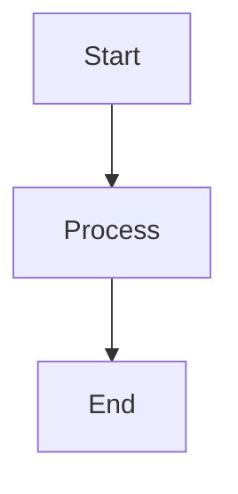
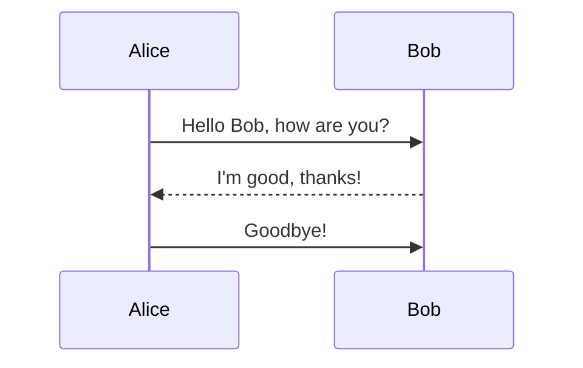
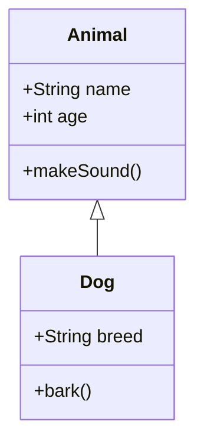

# Test Document with Mermaid Diagrams

This is a test markdown document that contains multiple Mermaid diagrams.

## Flow Chart

Some text between the diagrams.

## Sequence Diagram

## Class Diagram

End of document.
